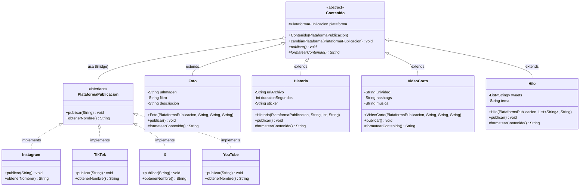

# 🌉 Patrón Bridge - Sistema de Publicación Multi-Red

[](https://www.oracle.com/java/)
[](https://refactoring.guru/design-patterns/bridge)

Sistema de publicación de contenido en múltiples redes sociales que implementa el **patrón de diseño Bridge** para evitar la explosión combinatoria de clases.

## 📋 Descripción

Este proyecto es una solución al problema clásico de manejar múltiples dimensiones que varían independientemente. En lugar de crear una clase por cada combinación de **tipo de contenido × plataforma**, el patrón Bridge separa ambas dimensiones permitiendo que evolucionen de forma independiente.

### Problema Resuelto

**Sin Bridge (Explosión Combinatoria):**
```
FotoInstagram.java
FotoTikTok.java
FotoX.java
FotoYouTube.java
HistoriaInstagram.java
HistoriaTikTok.java
...
Total: 4 tipos × 4 plataformas = 16 clases
```

**Con Bridge (Escalabilidad Lineal):**
```
4 tipos de contenido + 4 plataformas = 8 clases
Reducción del 50%
```

## 🏗️ Arquitectura del Patrón Bridge
```
┌─────────────────────────────────────┐
│  Abstracción (QUÉ se publica)       │
│  --------------------------------   │
│  • Foto                             │
│  • Historia                         │
│  • Video Corto                      │
│  • Hilo                             │
└──────────┬──────────────────────────┘
           │
           │ usa (composición)
           │
┌──────────┴──────────────────────────┐
│  Implementación (DÓNDE se publica)  │
│  --------------------------------   │
│  • Instagram                        │
│  • TikTok                           │
│  • X (Twitter)                      │
│  • YouTube                          │
└─────────────────────────────────────┘
```

## 📂 Estructura del Proyecto
```
BRIDGE/
├── README.md
├── JUSTIFICACION_TECNICA.md
└── src/
    ├── plataforma/              # Implementación (DÓNDE)
    │   ├── PlataformaPublicacion.java  (Interfaz)
    │   ├── Instagram.java
    │   ├── TikTok.java
    │   ├── X.java
    │   └── YouTube.java
    │
    ├── contenido/               # Abstracción (QUÉ)
    │   ├── Contenido.java       (Clase abstracta)
    │   ├── Foto.java
    │   ├── Historia.java
    │   ├── VideoCorto.java
    │   └── Hilo.java
    │
    └── Main.java                # Programa principal con demos
```

## 🚀 Cómo Ejecutar

### Requisitos Previos

- Java JDK 8 o superior
- Terminal o CMD

### Compilar

**Windows:**
```cmd
cd src
javac plataforma\*.java contenido\*.java Main.java
```

**Linux/Mac:**
```bash
cd src
javac plataforma/*.java contenido/*.java Main.java
```

### Ejecutar
```bash
java Main
```

## 💻 Ejemplo de Uso

### Crear y Publicar Contenido
```java
// Crear plataformas
PlataformaPublicacion instagram = new Instagram();
PlataformaPublicacion tiktok = new TikTok();

// Crear contenido con plataforma inicial
Contenido foto = new Foto(
    instagram, 
    "https://ejemplo.com/atardecer.jpg",
    "Valencia",
    "Atardecer increíble en la playa 🌅 #sunset"
);

// Publicar en Instagram
foto.publicar();
```

### Cambiar Plataforma Dinámicamente
```java
// Cambiar a TikTok (sin recompilar, sin modificar código)
foto.cambiarPlataforma(tiktok);

// Publicar en TikTok (mismo objeto, diferente comportamiento)
foto.publicar();
```

### Publicar Diferentes Tipos de Contenido
```java
// Video en YouTube
Contenido video = new VideoCorto(
    youtube,
    "https://ejemplo.com/tutorial.mp4",
    "#java #programacion #tutorial",
    "Lofi Hip Hop"
);
video.publicar();

// Hilo en X (Twitter)
List<String> tweets = Arrays.asList(
    "El patrón Bridge es increíblemente útil",
    "Separa la abstracción de la implementación",
    "Perfecto para sistemas multi-plataforma 🚀"
);
Contenido hilo = new Hilo(x, tweets, "Patrón Bridge");
hilo.publicar();
```

## 🎯 Características Implementadas

### ✅ Restricciones Cumplidas

| Restricción | Estado | Implementación |
|-------------|--------|----------------|
| Sin `if/else/switch` para decidir plataforma | ✅ | Delegación polimórfica |
| Sin clases por cada combinación | ✅ | 8 clases en lugar de 16 |
| Separación abstracción/implementación | ✅ | Paquetes `contenido` y `plataforma` |
| Solo composición (no herencia múltiple) | ✅ | `plataforma` como atributo |
| Extensible sin modificar código existente | ✅ | Open/Closed Principle |

### ✅ Ventajas Demostradas

- **Escalabilidad**: Agregar nueva plataforma = 1 clase nueva
- **Mantenibilidad**: Cambios localizados, sin efecto dominó
- **Flexibilidad**: Cambio de comportamiento en runtime
- **Testeo**: Componentes aislados y fáciles de probar
- **SOLID**: Cumple los 5 principios

## 🎬 Escenarios de Prueba

El `Main.java` incluye 7 escenarios completos:

1. ✅ Publicar Foto en Instagram
2. ✅ Cambiar Foto de Instagram a TikTok
3. ✅ Publicar Historia en Instagram
4. ✅ Publicar Video Corto en YouTube
5. ✅ Cambiar Video de YouTube a TikTok
6. ✅ Publicar Hilo en X (Twitter)
7. ✅ Cambiar Hilo de X a Instagram

Cada escenario demuestra:
- Publicación exitosa sin condicionales
- Cambio dinámico de plataforma
- Salida específica por plataforma
- Sin modificar código existente

## 📊 Comparación: Sin Bridge vs Con Bridge

### Agregar Nueva Plataforma (LinkedIn)

**Sin Bridge:**
```java
// Necesitas crear 4 nuevas clases
FotoLinkedIn.java
HistoriaLinkedIn.java
VideoCortoLinkedIn.java
HiloLinkedIn.java
```

**Con Bridge:**
```java
// Solo 1 nueva clase
public class LinkedIn implements PlataformaPublicacion {
    @Override
    public void publicar(String contenido) {
        // implementación
    }
}
```

### Tabla de Crecimiento

| Plataformas | Tipos | Sin Bridge | Con Bridge | Ahorro |
|-------------|-------|------------|------------|--------|
| 2 | 2 | 4 clases | 4 clases | 0% |
| 3 | 3 | 9 clases | 6 clases | 33% |
| 4 | 4 | 16 clases | 8 clases | **50%** |
| 5 | 5 | 25 clases | 10 clases | 60% |
| 10 | 10 | 100 clases | 20 clases | **80%** |

## 📖 Diagrama UML


## 🧠 Conceptos Clave del Patrón Bridge

### Abstracción (Contenido)
Representa **QUÉ** se publica. Contiene la lógica de alto nivel y delega la implementación específica a las plataformas.
```java
public abstract class Contenido {
    protected PlataformaPublicacion plataforma;  // Composición (Bridge)
    
    public void publicar() {
        String contenido = formatearContenido();
        plataforma.publicar(contenido);  // Delegación
    }
}
```

### Implementación (Plataforma)
Define **CÓMO** se realiza la publicación en cada red específica.
```java
public interface PlataformaPublicacion {
    void publicar(String contenidoFormateado);
}
```

### El "Puente" (Bridge)
La composición entre `Contenido` y `PlataformaPublicacion` es el puente que permite:
- Desacoplar las dos dimensiones
- Cambiar implementación en runtime
- Extender sin modificar

## 🎓 Casos de Uso del Patrón Bridge

El patrón Bridge es útil cuando:

- ✅ Tienes **dos dimensiones ortogonales** que varían independientemente
- ✅ Quieres evitar **explosión combinatoria** de clases
- ✅ Necesitas **cambiar implementación en runtime**
- ✅ Deseas que abstracción e implementación **evolucionen por separado**
- ✅ Quieres **ocultar detalles de implementación** al cliente

### UML

[](https://mermaid.live/edit#pako:eNrFVl1v2jAU_SuW9wIdoJqPQCxUaetUrdI2VSqauokXJ3aC1cRGjt11o_S3z-QDTEna9aEsD3Fin3PvudfXN1nBUFIGMQwTkmWfOIkVSecC2CufAVcJ0SSSKiVXJkh4SEIuBVgVkM01nXKhmYpIyM7OdtPvlwVcta614iIGobQwwam82BjTjFDZBneSU4cjAwth6ptMA8VabVBQC8C6GFxtlyLTuWBXzzEcz_jtTN4e2-vNsR3-kGZmAnZst-eVyf0yI0GmFQm1W2Xv6stzuZ11VGzNtmpJbQcakjTgRO1wDZSngW6TU6ycOEKjMj1qJ6NKxEljJi6k3ktCt0y6UcllSmImDpcinmglHU0bG_XyO6X_amw3R_JvgTTG8ZlnWipOGmL5oMIFv3NEd21LAdSoXOY1i42gMnPUVfZeisuaebugvnPK5LlUjVuUAw5XFiRb2LblxrMz9f93KtkP54tN9WNBegT6F2N6fyOSRsku8y0E1x_96UOv53wYMODpMmEpE5XuZ2hlW38V5-Z18KqlHpKK-673TR-63aIBYMDu7STNaiHbs_U8zKnWl-wlB5CnQGlx9UFiYDICWh8VpzFrww6M7RPEEUky1oEps_DNO8xLbA71wqZgDrF9pCwiJtFzOBdry1sS8VPKFGKtjGUqaeJF9WKW1JZJ-bOyRVi5zFaOERpidIpyExCv4D3EPuqhwQih_ngyQMgfDzvwN8TeuDcejCbI8wcj30OT_roD_-Q-T3uTft_zhsOB740nyO9ba4xym-ev5d_SZlj_BY7T8TM)

## 👨‍💻 Autor

**Javier Rodríguez**  
Universidad Distrital Francisco José de Caldas  
Ingeniería de Sistemas
